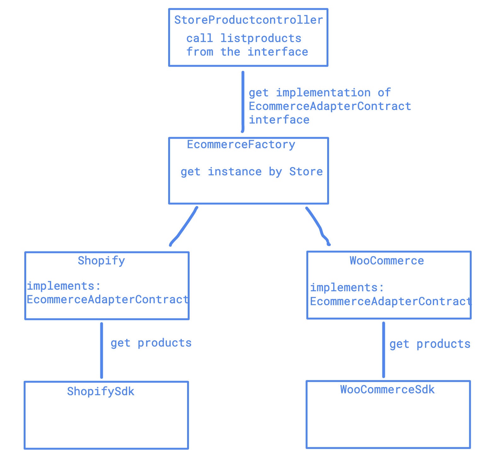
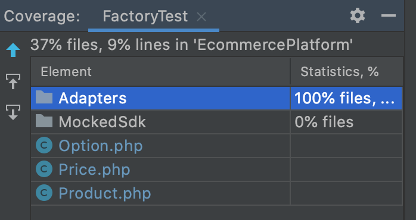

# Project Setup
***Prerequisite: please make sure docker and docker-compose are installed on your local***

Start the project by executing
```
docker-compose up -d
```

# Running test
Run `phpunit` within the `web` container by executing the command below
```
docker-compose exec web phpunit
```

# Api documentation
Once the docker compose is up, you can visit [the swagger doc](http://localhost:8080/api/documentation)

# Project structure


1. `StoreProductController@index` calls `EcommerceFactory` to get an instance of
`EcommerceAdapterContract`'s implementation based on the `Store` object received from
   the request.
   
1. `EcommerceFactory` then resolves either `Shopify` or `WooCommerce` adapter from the 
service container.
   
1. Each of the adapters is initialized as singletons in `EcommerceServiceProvider` and 
had their associated SDK injected as dependency.
   
1. While listing product, the request get routed though the controller, passing
through the factory based on the platform defined in DB, then hits the adapter 
   that parses the response from the SDK.
   
# Test Coverage

- Adapters are 100% covered by unit tests
- `Product`, `Option` and `Price` are POJO classes 
- `MockedSdk` is mocking the shopify and woocommerce sdks, so skipping their test as well
- Feature tests is omitted here as it is partially overlapping with the unit tests when using mocked data

# Notes
- Both shopify and woocommerce api parsing logics are not 100% tested against real data
- There might be type inconsistency for numerical values, where in some cases, it will be returned as string
- Both platforms are using mocked SDK, replace them to really SDK if possible.
- The `Dockerfile` used in this project is not meant for production usage as it is composed for the ease of getting the project up and running
in the shortest time possible
